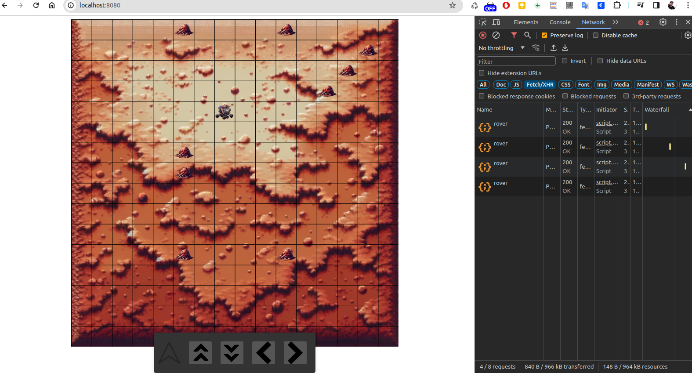
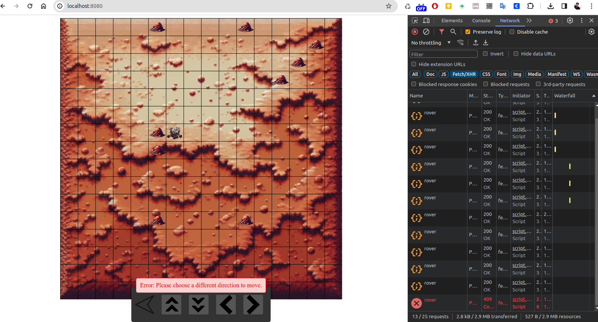

# Rover Mars API Documentation

This document outlines the API endpoints available in the Rover Mars application, which allows control over a rover's movements on a simulated Mars terrain.

## Endpoints

### Get Current Rover Position

- **GET** `/rover`
- **Description**: Retrieves the current state of the rover.
- **Response**: `200 OK`
- **Response Body**: RoverEntity JSON object.

### Move Rover

- **POST** `/rover`
- **Description**: Sends a command to move the rover.
- **Request Body**: `{"command": "F"}` where `command` is one of `["F", "B", "L", "R"]`.
- **Response**: `200 OK` on success, `409 CONFLICT` if an illegal move is attempted.
- **Response Body**: RoverEntity JSON object on success, ErrorResponse JSON object on error.

### Get Last Created Map

- **GET** `/map`
- **Description**: Retrieves the last created map.
- **Response**: `200 OK`
- **Response Body**: MapEntity JSON object wrapped in an Optional.

### Create Map

- **POST** `/map`
- **Description**: Creates a new map with specified dimensions.
- **Request Body**: `{"width": 16, "height": 16}`
- **Response**: `200 OK` on success, `400 BAD REQUEST` on invalid dimensions.
- **Response Body**: MapEntity JSON object on success, error message on error.

### Create Obstacle

- **POST** `/obstacle`
- **Description**: Places a new obstacle on the map.
- **Request Body**: `{"x": 3, "y": 5, "mapId": 1}`
- **Response**: `200 OK` on success, `404 NOT FOUND` if map does not exist, `400 BAD REQUEST` if coordinates are invalid, `409 CONFLICT` if an obstacle already exists at the location.
- **Response Body**: ObstacleEntity JSON object on success, error message on error.

### Find Obstacles By Map ID

- **GET** `/obstacle/{mapId}`
- **Description**: Retrieves all obstacles for the given map ID.
- **Response**: `200 OK`
- **Response Body**: List of ObstacleEntity JSON objects.

## Error Handling

All endpoints return an `ErrorResponse` object in the case of an error, with a message detailing the nature of the error.

## UI Representation

The above screenshot shows the interface of the Rover Mars application, with controls to command the rover and visual feedback on the map.
